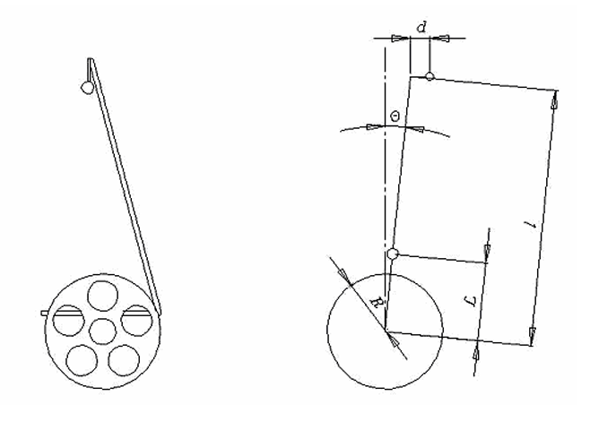
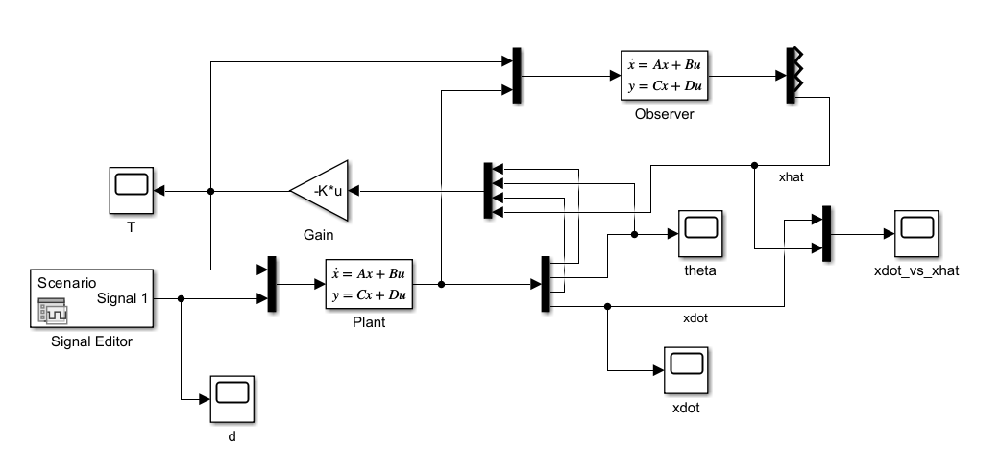

# Segway Controller Design

State-space controller design for a self-balancing Segway, exploring PID through observer-based full-state feedback.

<p align="center">
  
</p>

## What This Project Does

The physical system is a two-wheeled inverted pendulum: a 110 kg rider-plus-platform that must stay upright while responding to real-world disturbances like a shifting center of mass. The control challenge is to reject a body-weight offset while maintaining a safe tilt angle and bounded forward velocity — using a single motor torque input.

The project progresses through ten steps: deriving the open-loop transfer functions, confirming the plant is unstable, casting it in state-space form, designing pole-placement controllers of increasing sophistication, analyzing torque saturation and power consumption, and finally closing the loop with a Luenberger observer that reconstructs the full state from tilt angle alone.

## Key Results

- Open-loop plant has an unstable pole at s = +3.47, confirming inverted-pendulum behavior
- Full-state feedback with dominant poles at −4 ± 4j achieves 1-second settling time with a peak torque of 141 N·m
- Torque saturation at 80% of peak (≈ 113 N·m) causes closed-loop instability through integrator wind-up
- Dropping the integrator state (3-state model) reduces peak power from 717 W to 1.5 W — roughly 500× — at the cost of a 0.56° steady-state tilt offset under constant disturbance
- A Luenberger observer with eigenvalues placed 5× faster than the controller recovers full-state-feedback performance within 0.3 s, validating the separation principle in simulation

<p align="center">
  <br>
  <em>Closed-loop Simulink model for Step 10: plant (bottom) and Luenberger observer (top) run in parallel; the controller uses measured θ, θ̇, ∫θ and the observer's estimate of ẋ.</em>
</p>

## Repository Structure

```
matlab/       Standalone MATLAB scripts, one per design step (Steps 1–8, 10)
simulink/     Simulink models for simulation-based steps (Steps 3–10)
figures/      System diagram and plots
report/       Full project report with derivations and results
```

Step 9 (power consumption analysis) is Simulink-only; there is no corresponding `.m` script. Three Simulink variants exist for both Step 9 and Step 10, corresponding to different controller configurations (suffixed `_4`, `_5`, `_8` for Step 9; base, `_3state`, `_4state` for Step 10).

## How to Run

**Requirements:** MATLAB R2024a or later with Simulink.

Each script in `matlab/` declares its own physical parameters and can be run independently — open the file in MATLAB and press Run, or call it from the command window:

```matlab
run('matlab/step1_open_loop_analysis.m')
```

Before opening any Simulink model, run the corresponding `.m` script first to populate the workspace variables (`A`, `B`, `F`, `K`, and for Step 10, `L` and `C`). The Step 10 observer models will not simulate correctly without this step. The file `simulink/d_trapezoid.mat` is loaded automatically by the Step 4 and later models.

## Report

Full derivations, design rationale, and simulation results are in [`report/Segway_Project_Report.pdf`](report/Segway_Project_Report.pdf).

## Author

Ahmad Hassan  
ME 5659 Control Systems Engineering — Northeastern University, Spring 2026

*System description and governing equations adapted from the ME 5659 Term Project brief, Northeastern University.*
